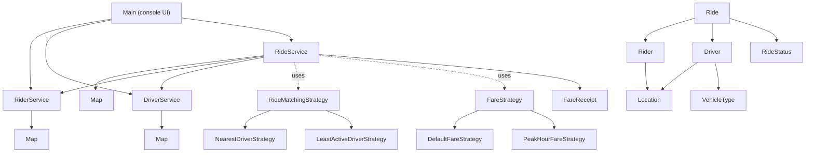
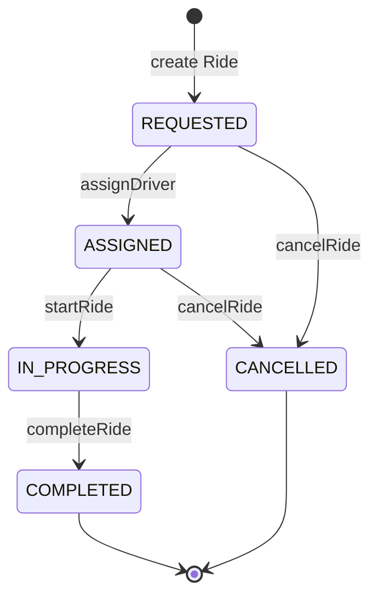
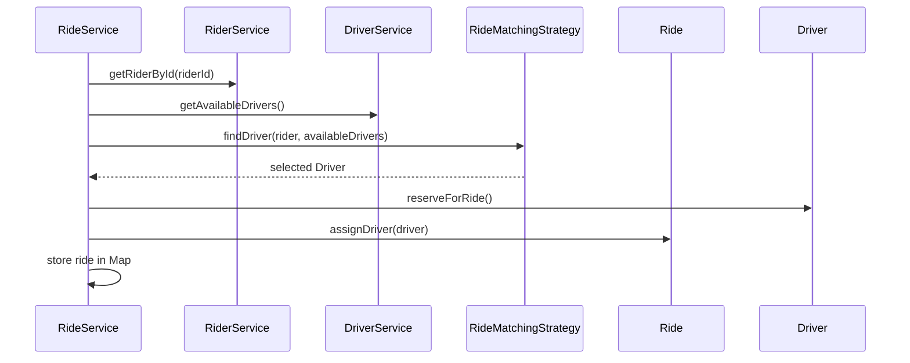
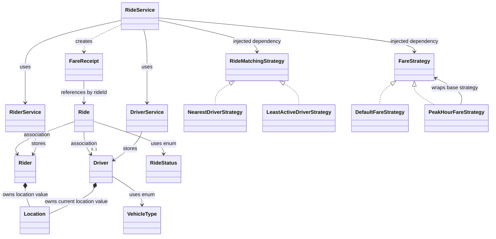

# RideWise_ModularRideSharingSystem

| Method | Allowed current status | New status | Driver availability |
|---|---|---|---|
| `assignDriver(driver)` | `REQUESTED` | `ASSIGNED` | Becomes unavailable/reserved |
| `startRide()` | `ASSIGNED` | `IN_PROGRESS` | Stays unavailable |
| `completeRide()` | `IN_PROGRESS` | `COMPLETED` | Becomes available |
| `cancelRide()` | `REQUESTED` | `CANCELLED` | No driver to release |
| `cancelRide()` | `ASSIGNED` | `CANCELLED` | Becomes available again |










Your design is heading in the right direction. One important correction: relationship labels must describe the actual ownership and lifecycle—not just which class calls another.



## Relationships in your project

| Relationship | Meaning in RideWise |
|---|---|
| `Rider → Ride` | **Association**. A ride references a rider, but the rider exists before and after the ride. |
| `Driver → Ride` | **Association**. A driver can exist without a ride and serve many rides over time. |
| `Rider/Driver → Location` | **Composition** conceptually. Each entity owns its location value; `Location` should be immutable. |
| `Ride → FareReceipt` | Currently an **ID-based association**, not composition: `FareReceipt` stores `rideId`, and `RideService` creates it. |
| `RideService → Strategies` | **Dependency**. Strategies are injected and can be replaced. |
| `PeakHourFareStrategy → FareStrategy` | **Composition**. Peak pricing wraps and reuses a base pricing strategy. |

A receipt can be treated as composition only if `Ride` directly owns it, for example with a `FareReceipt receipt` field. Your current model is actually better for audit/history: receipts often need to remain available even if a ride record is archived.

## Design principles demonstrated

### Composition over inheritance

You did not create fragile classes such as `PeakDriver extends Driver` or `PeakFare extends DefaultFare`.

Instead:

- `Driver has a Location`
- `Rider has a Location`
- `PeakHourFareStrategy has a FareStrategy`

This keeps behaviour reusable and avoids deep inheritance trees.

### Strategy Pattern and OCP

`RideService` depends on `RideMatchingStrategy` and `FareStrategy`.

Adding `HighestRatedDriverStrategy` or `WeekendFareStrategy` requires a new implementation, not edits to `RideService`. That is Open/Closed Principle.

### SOLID

- **SRP:** `Ride` manages ride transitions; `Driver` manages availability; strategies decide policy; services orchestrate.
- **OCP:** New matching/pricing policies are added as implementations.
- **LSP:** Every matching strategy must return a compatible result: matching `Driver` or `null` when none exists. Every fare strategy returns a monetary amount.
- **ISP:** Both strategy interfaces are small and focused.
- **DIP:** `RideService` receives interfaces, not `new NearestDriverStrategy()` internally.

### Low coupling / high cohesion

`RideService` coordinates the workflow but does not calculate distance or fare itself. `NearestDriverStrategy` calculates matching but does not reserve drivers. Each class has one focused responsibility.

### Law of Demeter

`Main` should talk only to services. `RideService` talks only to direct collaborators:

```text
RiderService
DriverService
RideMatchingStrategy
FareStrategy
Ride
```

Avoid chains such as:

```java
ride.getDriver().getCurrentLocation().getLatitude()
```

Distance logic belongs in `Location` and matching logic belongs in the strategy.

## Recommended final package structure

Your current uppercase packages work, but Java convention is lowercase. Refactor to this after the functional flow is stable:

```text
src/main/java/com/airtribe/ridewise/
├── Main.java
├── model/
│   ├── Rider.java
│   ├── Driver.java
│   ├── Ride.java
│   ├── Location.java
│   ├── FareReceipt.java
│   ├── RideStatus.java
│   └── VehicleType.java
├── service/
│   ├── RiderService.java
│   ├── DriverService.java
│   └── RideService.java
├── strategy/
│   ├── RideMatchingStrategy.java
│   ├── NearestDriverStrategy.java
│   ├── LeastActiveDriverStrategy.java
│   ├── FareStrategy.java
│   ├── DefaultFareStrategy.java
│   └── PeakHourFareStrategy.java
├── exception/
│   └── NoDriverAvailableException.java
└── util/
    └── IdGenerator.java
```
