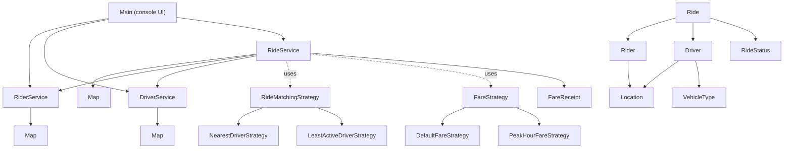
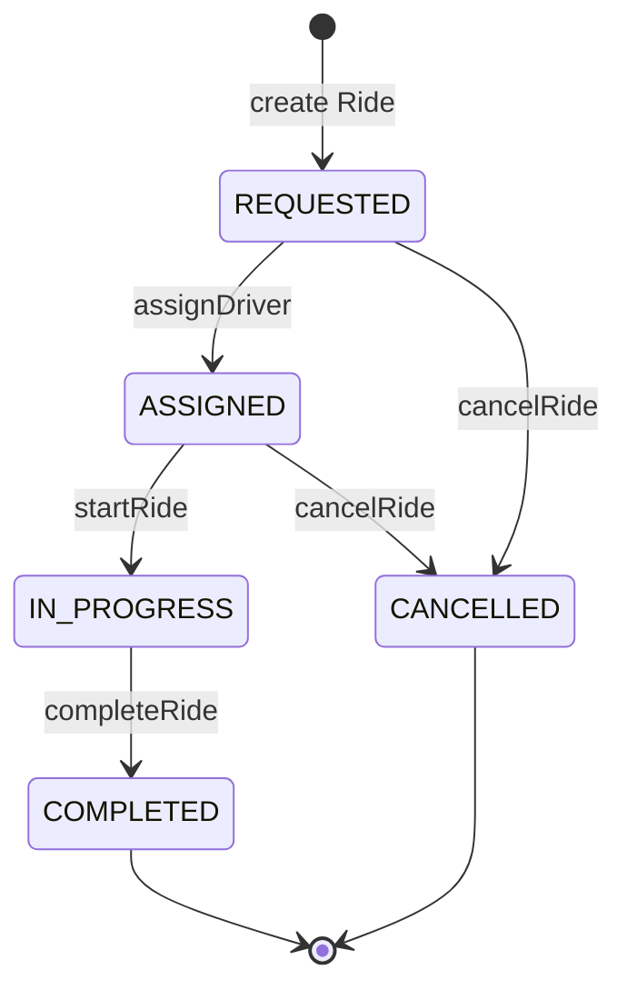

# RideWise_ModularRideSharingSystem

| Method | Allowed current status | New status | Driver availability |
|---|---|---|---|
| `assignDriver(driver)` | `REQUESTED` | `ASSIGNED` | Becomes unavailable/reserved |
| `startRide()` | `ASSIGNED` | `IN_PROGRESS` | Stays unavailable |
| `completeRide()` | `IN_PROGRESS` | `COMPLETED` | Becomes available |
| `cancelRide()` | `REQUESTED` | `CANCELLED` | No driver to release |
| `cancelRide()` | `ASSIGNED` | `CANCELLED` | Becomes available again |

